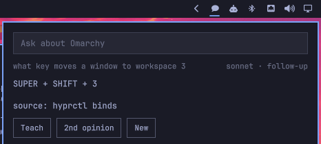

# Ask Omarchy

A bar widget that answers questions about *your* Omarchy machine, from your own
live config, using the `claude` CLI you are already signed into.



## Install

```bash
omarchy plugin add https://github.com/RobGilto/ask-omarchy.git --enable
~/.config/omarchy/plugins/ask-omarchy.ask/install.sh
```

The second line is not optional and not automatic: Omarchy's plugin installer
never executes anything from a plugin, so putting `bin/omarchy-ask` on your
PATH is a step you take yourself, after reading it.

### Requirements

| Needs | Why | Ships with |
|---|---|---|
| Omarchy Quattro (`omarchy-shell`) | the plugin is a bar widget | Omarchy |
| `claude`, signed in | every answer is a real turn on your own Claude account | you install it |
| `jq`, `uuidgen` | building the context bundle and session ids | base Arch |
| `hyprctl` | live binds and the Lua dispatcher API | Hyprland |
| `omarchy-launch-tui` | opens the terminal for **2nd opinion** | Omarchy |

Optional: a Firecrawl MCP server, used only by `omarchy-ask docs --refresh` to
cache the manual. Everything else works without it.

The plugin itself asks for no keys, reads no credentials, and stores nothing in
its own directory. All state lives in `~/.local/state/omarchy/ask/`.

### Removal

```bash
omarchy plugin remove ask-omarchy.ask
rm -f ~/.local/bin/omarchy-ask          # the symlink install.sh created
rm -rf ~/.local/state/omarchy/ask       # context bundle, manual cache, and
                                        # everything you taught it
```

Keep that last directory if you might reinstall — `expertise.md` is the part
you cannot regenerate.

A question box in the bar. Type "how do I move a window to workspace 3" and get
the answer for *this* machine, not for Hyprland in general.

The widget is strictly a display. All the knowledge work happens in
`~/.local/bin/omarchy-ask`, which assembles the context and runs `claude -p`;
the panel reads the stream-json it prints and draws the text as it arrives.
That split is deliberate: every answer can be reproduced and debugged from a
terminal without the shell in the way.

## What it knows

| Source | How it reaches the model |
|---|---|
| Keybindings declared in Omarchy's Lua bind files, including this machine's overrides | inline, every question |
| `hyprctl binds` as Hyprland reports them right now | inline, as a cross-check |
| `~/.config/hypr/*.conf`, `*.lua`, and `~/.config/omarchy/shell.json` | inline |
| The `omarchy-*` commands installed | inline (names), source read on demand |
| The omarchy.org manual, 52 pages | on disk in `~/.local/state/omarchy/ask/docs/`, grepped when a question needs it |
| Corrections you have taught it | `expertise.md`, inline and ahead of everything else |

The context bundle rebuilds itself whenever a config file under `~/.config/hypr`
or `shell.json` is newer than the cache, so an edit is reflected in the next
answer. The manual is cached and only refreshes when asked:

```bash
omarchy-ask docs --refresh     # firecrawl over omarchy.org/manual
```

Two facts the collector has to work around, both from Omarchy declaring its
binds in Lua: `hyprctl` reports every bind's dispatcher as `__lua`, so the
description carries the meaning; and loop-generated binds arrive with an empty
key, so the workspace numbers are recovered from their descriptions.

## Teaching it

When an answer is wrong, click **Teach** under it (or press `t` when the field
is not focused). The field turns into a correction box; what you type is
appended to `~/.local/state/omarchy/ask/expertise.md` together with the
question and the line it got wrong, and the question is asked again
immediately so you can see the correction take.

```markdown
## 2026-08-21 · what key locks the screen
- Claude said: SUPER + CTRL + L
- Correct: Always add that hypridle locks after 300s idle.
```

That file is injected ahead of everything else on every fresh question, and
the system prompt says it outranks the machine context and the manual. It is
plain markdown on purpose: when an entry stops being true, open it and delete
the entry. Nothing prunes it automatically.

From a terminal:

```bash
omarchy-ask teach --question "..." --wrong "..." --right "..."
omarchy-ask expertise          # prints the path
```

Corrections only reach a *fresh* question. A follow-up resumes the existing
Claude session, which already has the older context — that is why teaching
starts a new conversation rather than continuing the old one.

## Second opinion

**2nd opinion** hands the question and the answer to a fresh interactive Claude
in a terminal (`omarchy-launch-tui`, app-id `org.omarchy.ask-review`), running
opus while the widget answers with sonnet — a second opinion from the same
model is not one.

The primer tells it to verify from primary sources (`hyprctl binds -j`,
`hyprctl eval`, the config, omarchy's own sources, the manual cache), to test
claims it can test rather than read them, and explicitly **not** to treat
`context.md` as evidence, since that file is what produced the answer under
review. It ends with the `omarchy-ask teach` command line, so the reviewing
session can record the correction itself and the widget learns from it.

That is the loop: ask → doubt → verify independently → teach.

```bash
omarchy-ask review --question "..." --answer "..."   # same thing, from a terminal
omarchy bar set ask-omarchy.ask reviewModel sonnet
```

## Interactions

- Bar icon: left = open, right = new conversation.
- Buttons under the answer: **Teach** records a correction, **2nd opinion**
  opens an opus session in a terminal to check it, **New** forgets the
  conversation.
- Keys with the field unfocused: `t` teach, `o` second opinion, `n` new.
- `SUPER + ALT + A` toggles the panel.
- In the panel: Enter asks, Esc clears the field then hands keys back, Esc
  again closes. A second question in the same panel is a follow-up — the CLI
  resumes the same Claude session, so "and to workspace 4?" works.
- IPC: `omarchy-shell ask-omarchy.ask <open|close|toggle|reset>` and
  `omarchy-shell ask-omarchy.ask ask "<question>"`.

## Settings

```bash
omarchy bar set ask-omarchy.ask model haiku          # haiku | sonnet | opus
omarchy bar set ask-omarchy.ask keepSession false --json
```

`OMARCHY_ASK_MODEL`, `OMARCHY_ASK_EFFORT`, and `OMARCHY_ASK_DOCS_MAX_AGE`
override the same things for the CLI.

## Licence

MIT, see [LICENSE](LICENSE).

## Cost

Every question is a real turn against your Claude subscription — sonnet with a
~50 KB context, about 3-5 seconds. If you run the `omarchy.agents` widget, that
is where the cost shows up.
